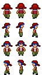

# Phaser RPG

## Concept

- The PhaserRPG game which i called the lost forest, is a game where the goal of the game is to collect as many coins as possible while avoiding the man eating maggots which are the enemies.

## Game play

- PRESS UP Arrow key to walk up, in backward direction
- PRESS DOWN Arrow key to walk down, in front direction
- PRESS RIGHT Arrow key to walk in right direction
- PRESS LEFT Arrow key to walk in left direction 

 ### Registration process

- At the beginning of the game a player can write their name in the text box present there and press ENTER key to register for the game.
- If the player starts the game without registering with his name, the player authomatically take up the default name kene.

### Scoring System

- By collecting a coin, a player gets 10 points.
- With the bite of each huge maggot a player looses 1 life.
- A player can view self score along with the top 10 scorers at Leader Board.

## Elements

### Player Character

### Enemy Character

### Coin

