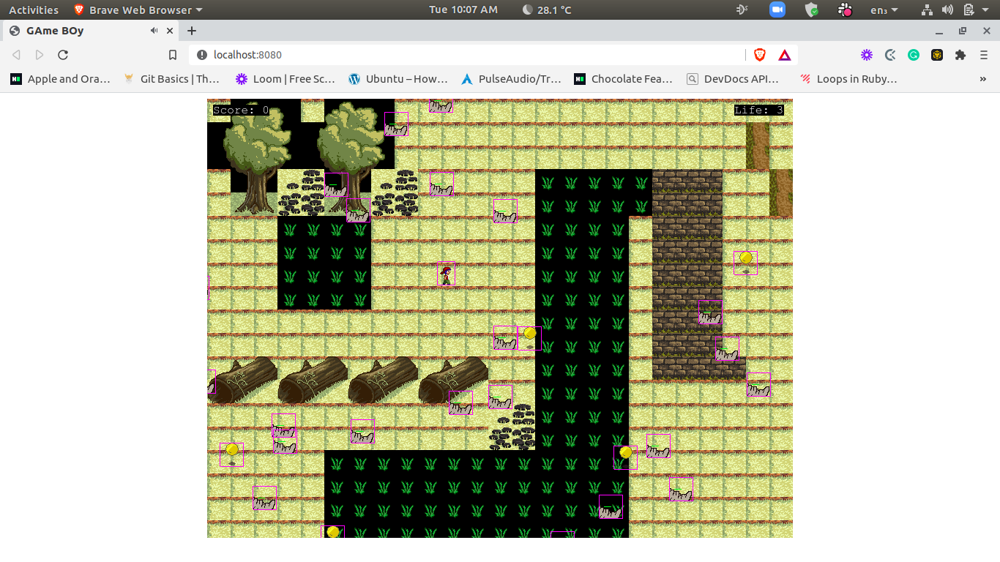

## Phaser RPG

> Phaser RPG game made with phaser JS

The PhaserRPG game which i called the lost forest, is a game where the goal of the game is to collect as many coins as possible while avoiding the man eating maggots which are the enemies.
## Built With 

- Phaser 3 Game Engine
- Tiled Map Editor
- HTML5
- JAVASCRIPT
- WEBPACK
- JEST

## Live Demo

[Live Demo Link](https://upbeat-heisenberg-d05836.netlify.app)

### Prerequisites

- Modern Browser (Chrome, Firefox...)
- Node.js
## Getting Started

To get a local copy up and running follow these simple example steps.

- clone the repo into a folder of your choice : `git@github.com:keneogu/PhaserRPG.git`
- `cd PhaserRPG`
- `npm install`
- `npm run start`

## Test

To run tests, run the following command in the terminal (while in the root directory):

- `npm test`

# Author

👤 **Kenechukwu Oguagbaka**

- GitHub: [@keneogu](https://github.com/keneogu)
- Twitter: [@keneogu](https://twitter.com/keneogu)
- LinkedIn: [@keneogu](https://www.linkedin.com/in/kene-ogu/)

## 🤝 Contributing

Contributions, issues and feature requests are welcome!

Feel free to check the [issues page](https://github.com/keneogu/PhaserRPG/issues).

## Acknowledgments

- Microverse for the ReadMe template

## Show your support

Give a ⭐️ if you like this project!

## 📝 License

Copyright 2021 Kenechukwu Oguagbaka

Permission is hereby granted, free of charge, to any person obtaining a copy of this software and associated documentation files (the "Software"), to deal in the Software without restriction, including without limitation the rights to use, copy, modify, merge, publish, distribute, sublicense, and/or sell copies of the Software, and to permit persons to whom the Software is furnished to do so, subject to the following conditions:

The above copyright notice and this permission notice shall be included in all copies or substantial portions of the Software.

THE SOFTWARE IS PROVIDED "AS IS", WITHOUT WARRANTY OF ANY KIND, EXPRESS OR IMPLIED, INCLUDING BUT NOT LIMITED TO THE WARRANTIES OF MERCHANTABILITY, FITNESS FOR A PARTICULAR PURPOSE AND NONINFRINGEMENT. IN NO EVENT SHALL THE AUTHORS OR COPYRIGHT HOLDERS BE LIABLE FOR ANY CLAIM, DAMAGES OR OTHER LIABILITY, WHETHER IN AN ACTION OF CONTRACT, TORT OR OTHERWISE, ARISING FROM, OUT OF OR IN CONNECTION WITH THE SOFTWARE OR THE USE OR OTHER DEALINGS IN THE SOFTWARE.